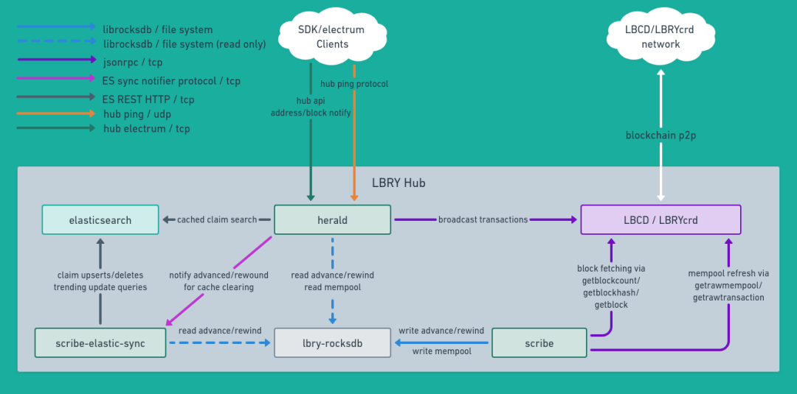

# LBRY Hub NG

LBRY Hub NG is a community-maintained fork of [LBRY Hub](https://github.com/lbryio/hub), originally developed by LBRY Inc. This project is maintained independently of LBRY Inc.; its changes and releases are community work, not official LBRY Inc. releases. Credit and license notices for the original authors are preserved.

The repository has moved from `kodxana/scribe` to `kodxana/lbry-hub-ng`. The Python package remains `hub`; commands such as `scribe` and `herald` and existing database paths keep their names.

This repo provides a python library, `hub`, for building services that use the processed data from the [LBRY blockchain](https://github.com/lbryio/lbrycrd) in an ongoing manner. Hub contains a set of three core executable services that are used together:
 * `scribe` ([hub.scribe.service](hub/service.py)) - maintains a [rocksdb](https://github.com/kodxana/lbry-rocksdb-ng) database containing the LBRY blockchain.
 * `herald` ([hub.herald.service](hub/herald/service.py)) - an electrum server for thin-wallet clients (such as [LBRY SDK NG](https://github.com/kodxana/lbry-sdk-ng)), provides an api for clients to use thin simple-payment-verification (spv) wallets and to resolve and search claims published to the LBRY blockchain.
 * `scribe-elastic-sync` ([hub.elastic_sync.service](hub/elastic_sync/service.py)) - a utility to maintain an elasticsearch database of metadata for claims in the LBRY blockchain



Features and overview of `hub` as a python library:
 * Uses CPython 3.13 on Linux x86-64 for the current test baseline
 * An interface developers may implement in order to build their own applications able to receive up-to-date blockchain data in an ongoing manner ([hub.service.BlockchainReaderService](hub/service.py))
 * Protobuf schema for encoding and decoding metadata stored on the blockchain ([hub.schema](hub/schema))
 * [Rocksdb 6.25.3](https://github.com/kodxana/lbry-rocksdb-ng/) based database containing the blockchain data ([hub.db](hub/db))
 * [A community driven performant trending algorithm](docs/trending%20algorithm.pdf) for searching claims ([code](hub/elastic_sync/fast_ar_trending.py))

## Installation

Build this fork from source or build your own Docker image as described below. Community releases belong on [this repository's releases page](https://github.com/kodxana/lbry-hub-ng/releases). Historical [upstream binaries](https://github.com/lbryio/hub/releases) and [lbry/hub Docker images](https://hub.docker.com/r/lbry/hub/tags) do not include this fork's fixes.

On Linux x86-64 with CPython 3.13, this fork installs `lbry-rocksdb-ng` 0.8.3
from a versioned GitHub release with a SHA-256 pin. The wheel requires
`manylinux_2_35` compatibility (including glibc 2.35 or newer). Alpine/musl,
other architectures and other Python versions are not supported by this build.
The installer no longer falls back to the abandoned binding.

The Python 3.13 candidate is version `1.1.0rc1`. See its
[release notes](docs/releases/1.1.0rc1.md) for compatibility and validation limits.

Create a fresh virtual environment when upgrading. The old and new bindings
both install `rocksdb` module files and must not coexist. Updating Hub in place
does not automatically remove the old distribution. The database directory and
RocksDB 6.25.3 engine are unchanged; do not delete database files when replacing
the Python environment.

### Build your own docker image

```
git clone https://github.com/kodxana/lbry-hub-ng.git
cd lbry-hub-ng
docker build -t lbry-hub-ng:development .
```

### Install from source

Use CPython 3.13 on Linux x86-64. A C compiler and Python development headers
are needed to build the resumable SHA-256 dependency from source.

1. clone the community repository
```
git clone https://github.com/kodxana/lbry-hub-ng.git
cd lbry-hub-ng
```
2. make a virtual env
```
python3.13 -m venv hub-venv
```
3. from the virtual env, install Hub
```
source hub-venv/bin/activate
pip install -e .
```

That completes the installation, now you should have the commands `scribe`, `scribe-elastic-sync` and `herald`

These can also optionally be run with `python -m hub.scribe`, `python -m hub.elastic_sync`, and `python -m hub.herald`

## Database tests

With Docker and a Linux daemon available, run `sh scripts/test.sh` to build and
test the installed Hub package on Python 3.13. The database tests use temporary
data and need no blockchain node or Elasticsearch server.

See [the testing guide](docs/testing.md) for the rebuilt RocksDB comparison and
the resolve integration suite, which runs with the SDK and isolated regtest nodes.

## Usage

### Requirements

Scribe needs elasticsearch and either the [lbrycrd](https://github.com/lbryio/lbrycrd) or [lbcd](https://github.com/lbryio/lbcd) blockchain daemon to be running.

With options for high performance, if you have 64gb of memory and 12 cores, everything can be run on the same machine. However, the recommended way is with elasticsearch on one instance with 8gb of memory and at least 4 cores dedicated to it and the blockchain daemon on another with 16gb of memory and at least 4 cores. Then the scribe hub services can be run their own instance with between 16 and 32gb of memory (depending on settings) and 8 cores. 

As of block 1147423 (4/21/22) the size of the scribe rocksdb database is 120GB and the size of the elasticsearch volume is 63GB.

### docker-compose
The recommended way to run a scribe hub is with docker. See [this guide](docs/cluster_guide.md) for instructions.

If you have the resources to run all of the services on one machine (at least 300gb of fast storage, preferably nvme, 64gb of RAM, 12 fast cores), see [this](docs/docker_examples/docker-compose.yml) docker-compose example.

### From source

### Options

#### Content blocking and filtering

For various reasons it may be desirable to block or filtering content from claim search and resolve results, [here](docs/blocking.md) are instructions for how to configure and use this feature as well as information about the recommended defaults.

#### Common options across `scribe`, `herald`, and `scribe-elastic-sync`:
  - `--db_dir` (required) Path of the directory containing lbry-rocksdb, set from the environment with `DB_DIRECTORY`
  - `--daemon_url` (required for `scribe` and `herald`) URL for rpc from lbrycrd or lbcd<rpcuser>:<rpcpassword>@<lbrycrd rpc ip><lbrycrd rpc port>.
  - `--reorg_limit` Max reorg depth, defaults to 200, set from the environment with `REORG_LIMIT`.
  - `--chain` With blockchain to use - either `mainnet`, `testnet`, or `regtest` - set from the environment with `NET`
  - `--max_query_workers` Size of the thread pool, set from the environment with `MAX_QUERY_WORKERS`
  - `--cache_all_tx_hashes` If this flag is set, all tx hashes will be stored in memory. For `scribe`, this speeds up the rate it can apply blocks as well as process mempool. For `herald`, this will speed up syncing address histories. This setting will use 10+g of memory. It can be set from the environment with `CACHE_ALL_TX_HASHES=Yes`
  - `--cache_all_claim_txos` If this flag is set, all claim txos will be indexed in memory. Set from the environment with `CACHE_ALL_CLAIM_TXOS=Yes`
  - `--prometheus_port` If provided this port will be used to provide prometheus metrics, set from the environment with `PROMETHEUS_PORT`

#### Options for `scribe`
  - `--db_max_open_files` This setting translates into the max_open_files option given to rocksdb. A higher number will use more memory. Defaults to 64.
  - `--address_history_cache_size` The count of items in the address history cache used for processing blocks and mempool updates. A higher number will use more memory, shouldn't ever need to be higher than 10000. Defaults to 1000.
  - `--index_address_statuses` Maintain an index of the statuses of address transaction histories, this makes handling notifications for transactions in a block uniformly fast at the expense of more time to process new blocks and somewhat more disk space (~10gb as of block 1161417).

#### Options for `scribe-elastic-sync`
  - `--reindex` If this flag is set drop and rebuild the elasticsearch index.

#### Options for `herald`
  - `--host` Interface for server to listen on, use 0.0.0.0 to listen on the external interface. Can be set from the environment with `HOST`
  - `--tcp_port` Electrum TCP port to listen on for hub server. Can be set from the environment with `TCP_PORT`
  - `--udp_port` UDP port to listen on for hub server. Can be set from the environment with `UDP_PORT`
  - `--elastic_services` Comma separated list of items in the format `elastic_host:elastic_port/notifier_host:notifier_port`. Can be set from the environment with `ELASTIC_SERVICES`
  - `--query_timeout_ms` Timeout for claim searches in elasticsearch in milliseconds. Can be set from the environment with `QUERY_TIMEOUT_MS`
  - `--blocking_channel_ids` Space separated list of channel claim ids used for blocking. Claims that are reposted by these channels can't be resolved or returned in search results. Can be set from the environment with `BLOCKING_CHANNEL_IDS`.
  - `--filtering_channel_ids` Space separated list of channel claim ids used for blocking. Claims that are reposted by these channels aren't returned in search results. Can be set from the environment with `FILTERING_CHANNEL_IDS`
  - `--index_address_statuses` Use the address history status index, this makes handling notifications for transactions in a block uniformly fast (must be turned on in `scribe` too).

## Contributing

Bug reports, tests, documentation and focused pull requests are welcome in [this repository](https://github.com/kodxana/lbry-hub-ng/issues). Include reproduction steps and run the relevant [tests](docs/testing.md). The original project's compensation program does not apply to this fork.

Related community projects: [LBRY SDK NG](https://github.com/kodxana/lbry-sdk-ng) and [lbry-rocksdb-ng](https://github.com/kodxana/lbry-rocksdb-ng).

## License

This project is MIT licensed. For the full license, see [LICENSE](LICENSE).

## Security

Contact [@kodxana](https://github.com/kodxana) to arrange private disclosure before sharing vulnerability details. Keep public issues free of exploit details and private data. LBRY Inc. email addresses are not support contacts for this fork.

## Contact

The fork is maintained by [@kodxana](https://github.com/kodxana) and community contributors. Use this repository's issues for general questions and bug reports.
